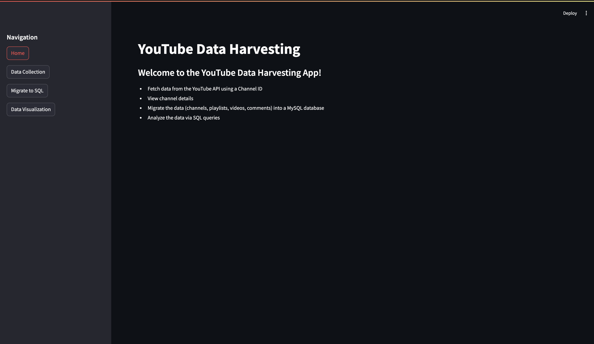

# 📊 YouTube Data Harvesting & Warehousing

A Streamlit-based web application that fetches YouTube channel data using the **YouTube Data API**, stores it in a **MySQL** database, and provides interactive analytical insights through SQL queries.

---

## 🚀 Features
- **Fetch YouTube Data** — Enter a channel ID to retrieve:
  - Channel name, subscribers, total views
  - Playlist IDs and Video details
  - Likes, comments, publish date, duration
- **Store Data in MySQL** — Persist multiple channels’ data for long-term analysis.
- **Run SQL Queries** — Predefined analytical queries to answer:
  1. All videos and their channels
  2. Channels with most videos
  3. Top 10 most viewed videos
  4. Comments count per video
  5. Videos with most likes
  6. Likes & dislikes per video
  7. Total views per channel
  8. Channels with videos published in 2022
  9. Average video duration per channel
  10. Videos with most comments
- **Data Visualization** — View query results as interactive tables and charts.
- **Database Management** — Option to clear all stored data.

---

## 🛠️ Tech Stack
- **Frontend:** Streamlit
- **Backend:** Python
- **Database:** MySQL
- **API:** YouTube Data API v3
- **Libraries:**  
  `streamlit`, `pandas`, `mysql-connector-python`,  
  `google-api-python-client`, `isodate`, `plotly`

---

## 📦 Installation
